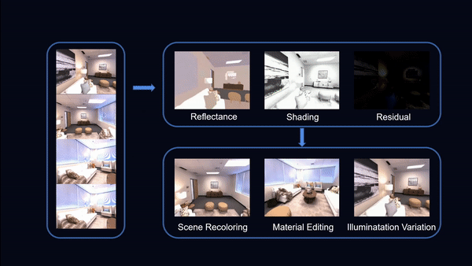
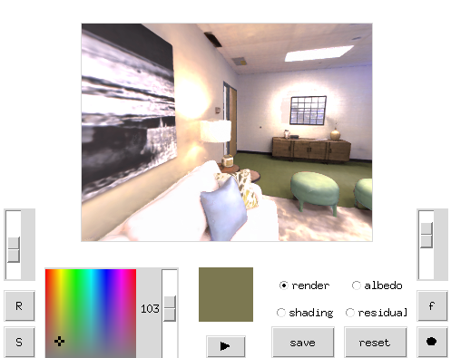

# IntrinsicNeRF: Learning Intrinsic Neural Radiance Fields for Editable Novel View Synthesis
### [Project Page](https://zju3dv.github.io/intrinsic_nerf/) | [Paper](https://arxiv.org/abs/2210.00647)
<br/>

> IntrinsicNeRF: Learning Intrinsic Neural Radiance Fields for Editable Novel View Synthesis

> [[Weicai Ye](https://ywcmaike.github.io/), [Shuo Chen](https://github.com/Eric3778)]<sup>Co-Authors</sup>, [Chong Bao](https://github.com/1612190130/), [Hujun Bao](http://www.cad.zju.edu.cn/home/bao/), [Marc Pollefeys](https://people.inf.ethz.ch/pomarc/), [Zhaopeng Cui](https://zhpcui.github.io/), [Guofeng Zhang](http://www.cad.zju.edu.cn/home/gfzhang)

> ICCV 2023



## Getting Started

For flawless reproduction of our results, the Ubuntu OS 20.04 is recommended. The models have been tested using Python 3.7, Pytorch 1.6.0, CUDA10.1. Higher versions should also perform similarly.

### Dependencies
Main python dependencies are listed below:
- Python >=3.7
- torch>=1.6.0 (integrate *searchsorted* API, otherwise need to use the third party implementation [SearchSorted](https://github.com/aliutkus/torchsearchsorted) )
- cudatoolkit>=10.1

Following packages are used for 3D mesh reconstruction:
- trimesh==3.9.9
- open3d==0.12.0

With Anaconda, you can simply create a virtual environment and install dependencies with CONDA by:
- `conda create -n intrinsicnerf python=3.7`
- `conda activate intrinsicnerf`
- `pip install -r requirements.txt`

## Datasets
We mainly use [Replica](https://github.com/facebookresearch/Replica-Dataset) and Blender Object datasets for experiments, where we train a new IntrinsicNeRF model on each 3D scene. Other similar indoor datasets with colour images, semantic labels and poses can also be used.


## For Replica Scene
### We use [pre-rendered Replica data](https://www.dropbox.com/sh/9yu1elddll00sdl/AAC-rSJdLX0C6HhKXGKMOIija?dl=0) provided by Semantic-NeRF. Please download the dataset and modify the data_dir in the configs/*.yaml.

### Running code
After cloning the codes, we can start to run IntrinsicNeRF in the root directory of the repository.

### IntrinsicNeRF training
For standard IntrinsicNeRF training with full dense semantic supervision. You can simply run following command with a chosen config file specifying data directory and hyper-params.
```
python3 train_SSR_main.py --config_file /SSR/configs/SSR_room0_config.yaml
```

## For Blender Object

```
cd object_level
```
See the README.md to download the dataset and modify the data_dir in the configs/*.txt.
And then choose the object to run the script, for example
```
mkdir logs/chair
touch logs/chair/out_message
CUDA_VISIBLE_DEVICES=0 nohup python run_nerf.py --config configs/chair.txt --exp chair --datadir YourData_Dir/chair > logs/chair/out_message 2>&1 &
```

## For editing
After training IntrinsicNeRF, the pretrained model, clustered information and the decomposition will be saved, so you can choose blender object or replica scene as you want. Please download and unzip the [Video_Data.tar.gz](https://pan.zju.edu.cn/share/a6fc0427c058c8c01b09567731) for editing. Take room0 as an example:
```
cd Video_Data
python gui.py --img_dir in/replica/room_0/step_200000/ --cluster_config in/replica/room_0/cluster/ --rate 20 --head_name room_0 --replica
```
The editing software is as follows:




### For more demos and qualitative results, please check our [project page](https://zju3dv.github.io/intrinsic_nerf/).


## Acknowledgements
Thanks [Semantic-NeRF](https://shuaifengzhi.com/Semantic-NeRF/) and [nerf-pytorch](https://github.com/yenchenlin/nerf-pytorch)  for providing nice and inspiring implementations of NeRF. 

## Citation
If you find this code useful for your research, please use the following BibTeX entry.

```bibtex
@inproceedings{Ye2023IntrinsicNeRF,
  title={{IntrinsicNeRF: Learning Intrinsic Neural Radiance Fields for Editable Novel View Synthesis}},
  author={Ye, Weicai and Chen, Shuo and Bao, Chong and Bao, Hujun and Pollefeys, Marc and Cui, Zhaopeng and Zhang, Guofeng},
  booktitle={Proceedings of the IEEE/CVF International Conference on Computer Vision},
  year={2023}
}
```

